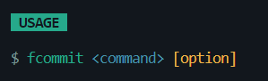
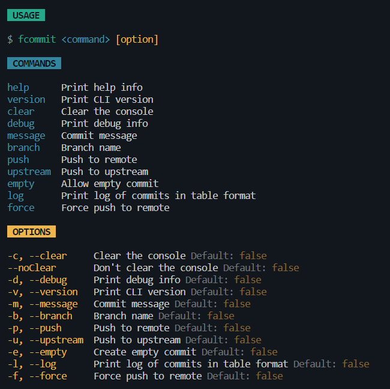
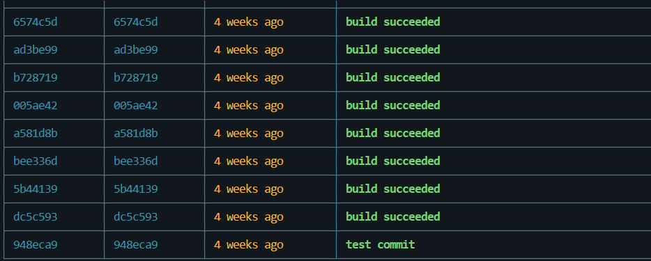

<h3 align="center">

</h3>

## fcommit

A basic cli tool for git commit and push.
Note this project is educational purpose to learn how cli tools work.

  

## Installation

install the package globally:

```bash

$ npm install fcommit -g

```

> Note: `fcommit` auto committer needs .gitignore file.

## Dependencies

> fcommit written in node.js. Node depends on JavaScript on a VM that is incredibly fast (V8). It is much faster than Ruby, Python, or Perl. That's the reason you have to install node. Download node.js

- [node.js](https://nodejs.org/en/)
- [cli-table](https://www.npmjs.com/package/cli-table)
- [cli-alert](https://www.npmjs.com/package/cli-alert)

## Usage

use the following command to get help:

```bash
    $ fcommit --help
```



A basic commit command:

- `fcommit` - commit all changes
- `git add .` is not necessary

```bash
$ fcommit -m "message"

```

- `fcommit -p` - push all changes
- `fcommit -p -f` - force push all changes
- `-u` - upstream

```bash
$ fcommit -p -f

```

- `fcommit -p -f -m "message"` - force push all changes with message

> example chaining:
> this will commit all changes and push all changes upstream in branch main

```bash
$ fcommit -m "message" -p -u -b main

```

> Note: if the branch is not passed ( `-b <your branch>` ) then the current branch will be used.

- pretty git log format
  ```bash
  $ fcommit --log
  $ fcommit -l
  ```
  
